# 💡 SkyBridge – Bluetooth-Mesh-Lampen in Home Assistant

SkyBridge macht aus einem **ESP32 für ein paar Euro** eine Brücke zwischen **Bluetooth-Mesh-Leuchten**
(z. B. **OPPLE BLE2** wie die LEDSkylight SDL-S) und **Home Assistant**. Die Lampen tauchen automatisch in
Home Assistant auf (MQTT-Discovery), mit Ein/Aus, Helligkeit und Farbtemperatur. Das alles läuft lokal, ohne Cloud und ohne Hersteller-App.

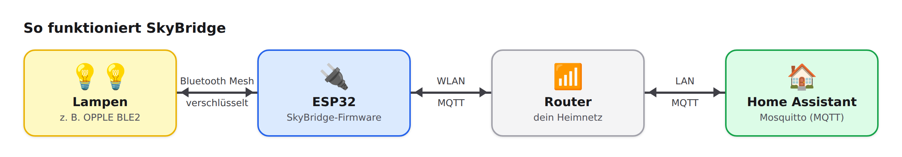

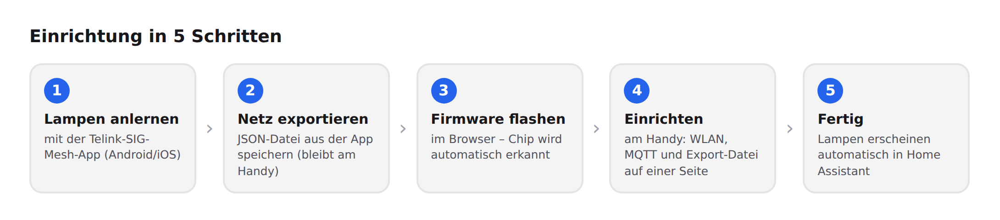

> Zum Vergleich: Das offizielle OPPLE-Gateway (Smart Connect Box) kostet rund 790 € und hat keine Home-Assistant-Anbindung.

## Inhalt

- [Was funktioniert](#was-funktioniert)
- [Was du brauchst](#was-du-brauchst)
- [Schritt 1 – Lampen mit der Telink-App anlernen](#schritt-1--lampen-mit-der-telink-app-anlernen)
- [Schritt 2 – Mesh-Netz exportieren](#schritt-2--mesh-netz-exportieren)
- [Schritt 3 – Firmware installieren](#schritt-3--firmware-installieren)
- [Schritt 4 – SkyBridge einrichten](#schritt-4--skybridge-einrichten)
- [Schritt 5 – Home Assistant](#schritt-5--home-assistant)
- [Fehlersuche](#fehlersuche)
- [Sicherheit](#sicherheit)
- [Für Entwickler](#für-entwickler)

---

## Was funktioniert

| Funktion | |
|---|---|
| Ein/Aus, Helligkeit, Farbtemperatur (1800–12000 K) | ✅ |
| Übergangszeiten (`transition`) | ✅ |
| Jede Lampe einzeln + Gruppe „Alle Lampen“ | ✅ |
| Zustand wird regelmäßig abgefragt (auch bei Schalten per App) | ✅ alle 30 s |
| Bis zu 16 Lampen | ✅ |
| Lampen und IV-Index werden automatisch gefunden | ✅ |
| Hersteller-Szenen / Effekte (z. B. OPPLE-Himmelseffekte) | ❌ (herstellerspezifisch) |

**Geeignete Lampen:** Leuchten mit **Bluetooth SIG Mesh** und Telink-Chip, die die Standard-Modelle
*Generic OnOff* (1000), *Light Lightness* (1300) und *Light CTL* (1303) anbieten. Getestet mit
OPPLE LEDSkylight SDL-S (BLE2). Andere Telink-Mesh-Leuchten funktionieren sehr wahrscheinlich auch.

## Was du brauchst

- Ein **ESP32-Board** aus der Liste unten. Klassische Arduinos (Uno, Nano, Mega) gehen **nicht**, weil sie weder WLAN noch Bluetooth haben.
- **Home Assistant** mit **MQTT** (z. B. Add-on *Mosquitto broker*).
- Ein **Android-Handy** oder **iPhone** für die Telink-App.
- Einen PC/Mac mit **Chrome oder Edge** zum Installieren der Firmware.
- Ein USB-Netzteil für den Dauerbetrieb.

### Unterstützte Boards

| Board | Chip | Reset-Taste |
|---|---|---|
| ESP32 DevKit V1 / WROOM | ESP32 | BOOT (GPIO0) |
| LOLIN / Wemos D32 | ESP32 | BOOT (GPIO0) |
| M5Stack Atom Lite | ESP32 | Frontknopf (GPIO39) |
| ESP32-S3 DevKitC | ESP32-S3 | BOOT (GPIO0) |
| Arduino Nano ESP32 | ESP32-S3 | B1 (GPIO0) |
| Seeed XIAO ESP32-S3 | ESP32-S3 | BOOT (GPIO0) |
| LOLIN / Wemos S3 Mini | ESP32-S3 | BOOT (GPIO0) |
| M5Stack AtomS3 | ESP32-S3 | Bildschirmtaste (GPIO41) |
| ESP32-C3 SuperMini / Zero | ESP32-C3 | BOOT (GPIO9) |
| Seeed XIAO ESP32-C3 | ESP32-C3 | BOOT (GPIO9) |
| ESP32-C6 DevKit / SuperMini | ESP32-C6 | BOOT (GPIO9) |
| Seeed XIAO ESP32-C6 | ESP32-C6 | BOOT (GPIO9) |
| ESP32-C5 DevKit *(experimentell)* | ESP32-C5 | BOOT (GPIO28) |

Der **Chip wird beim Installieren automatisch erkannt**, und es wird die passende Firmware gewählt. Das Board
selbst wählst du später auf der Einrichtungsseite aus, denn davon hängen die Reset-Taste und beim XIAO ESP32-C6 die Antenne ab.

> **Tipp:** Die Beschriftung auf billigen Boards stimmt nicht immer. Ein als „C3“ verkauftes Board kann
> in Wahrheit ein C6 sein. Der Installer erkennt den echten Chip.

---

## Schritt 1 – Lampen mit der Telink-App anlernen

Die Bridge braucht die Schlüssel des Mesh-Netzes. Die Hersteller-App (z. B. OPPLE Smart) gibt diese nicht
heraus. Deshalb werden die Lampen einmalig mit der **Telink-SIG-Mesh-App** neu angelernt.

> ⚠️ Danach lassen sich die Lampen **nicht mehr mit der Hersteller-App** steuern. Wer zurück will,
> setzt die Lampen zurück und lernt sie wieder mit der Hersteller-App an.

**App installieren:**
- **Android:** [`apps/android/TelinkBleMeshDemo-V4.1.0.4.apk`](apps/android/) herunterladen und installieren
  (Installation aus dieser Quelle einmalig erlauben).
- **iPhone:** [TelinkSigMesh im App Store](https://apps.apple.com/us/app/telinksigmesh/id1536722792)

**Anlernen:**
1. Die Lampen müssen **frei** sein, also in keinem Netz:
   - bisher mit der **Hersteller-App** verwendet: dort die Lampe **entfernen/löschen**, oder die Lampe laut ihrer Anleitung auf **Werkseinstellung** zurücksetzen.
   - bisher schon mit der **Telink-App** angelernt: in der Telink-App lang auf die Lampe drücken → Reiter **SETTINGS** → **Kick out** (löschen). Die Lampe setzt sich dabei selbst zurück.
   - Tipp: Lampen, die frei sind, erscheinen in der App **nRF Connect** mit dem Dienst *Mesh Provisioning Service*.
2. Hersteller-App **komplett schließen**.
3. Die Lampen am Wandschalter **kurz aus- und wieder einschalten**. Viele Lampen lassen sich nur in den ersten Minuten nach dem Einschalten anlernen.
4. In der Telink-App auf der Startseite **Device** oben rechts auf **„+“** tippen **(1)**.
5. Unter **Device Scan** erscheinen die freien Lampen **(1)**. Bei der Lampe erscheint **ADD**. Antippen und etwas Geduld haben: Nach etwa 10–30 Sekunden ist die Lampe angelernt.
   Bei mehreren Lampen jede einzeln hinzufügen (oder **ADD ALL** unten, sobald es aktiv ist).
6. Zurück auf der Startseite steht jede Lampe mit ihrer **Adresse**: `04(cid-27D)` bedeutet Adresse **`0004`** **(1)**.
   Antippen schaltet die Lampe, **ALL ON / ALL OFF** **(2)** schaltet alle. ✅
7. **Lang drücken** auf eine Lampe öffnet **Device Setting**: Ein/Aus **(1)**, Helligkeit **(2)** und Farbtemperatur **(3)**.

<p>
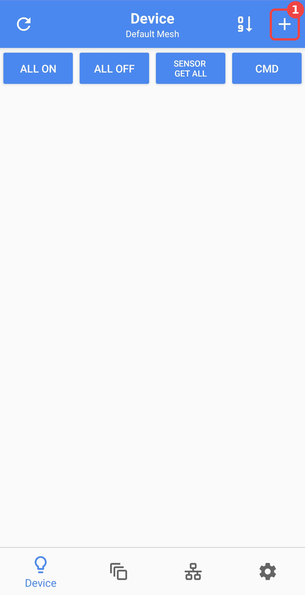
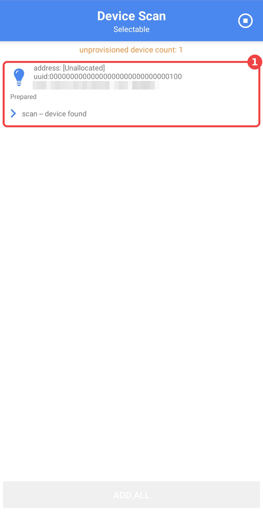
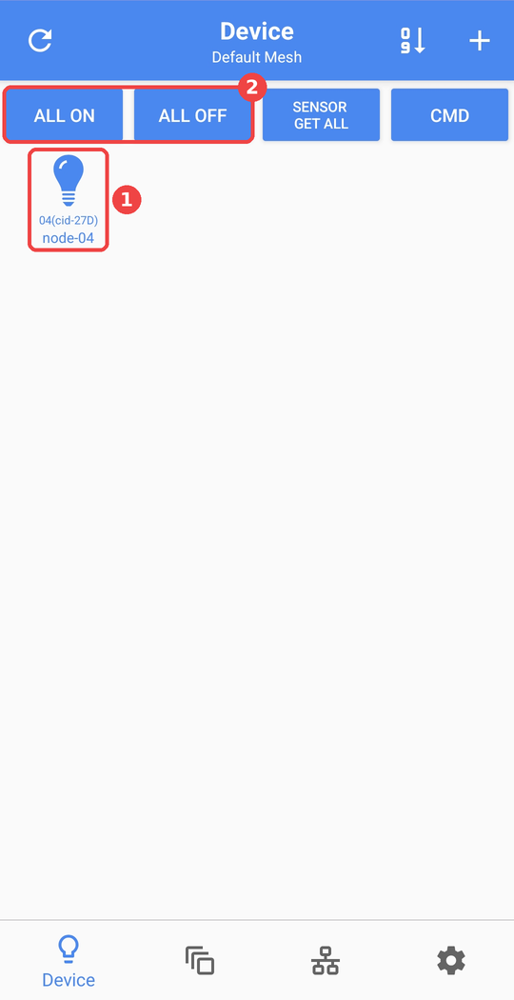
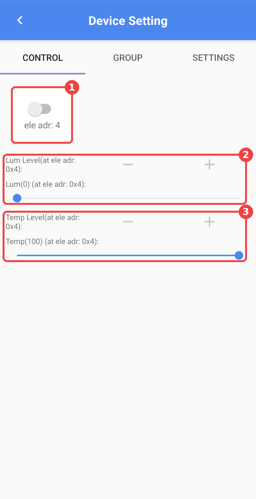
</p>

## Schritt 2 – Mesh-Netz exportieren

In der Telink-App das Netz als **JSON-Datei exportieren**:

1. Unten den Reiter **Setting** **(1)** → **Manage Network** **(2)**
2. Beim Netz *Default Mesh* auf **„•••“** **(3)** → **Share Export** **(4)**
3. Alle Net Keys angehakt lassen, **JSON File** **(5)** wählen → **EXPORT** **(6)**
4. Die App speichert die Datei (z. B. `mesh.json`) in einem Ordner auf dem Handy. Sie bleibt dort, denn du lädst sie in Schritt 4 direkt vom Handy hoch.

<p>
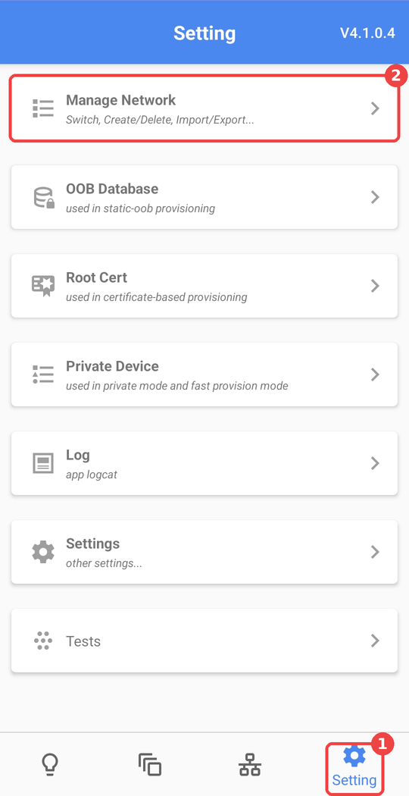
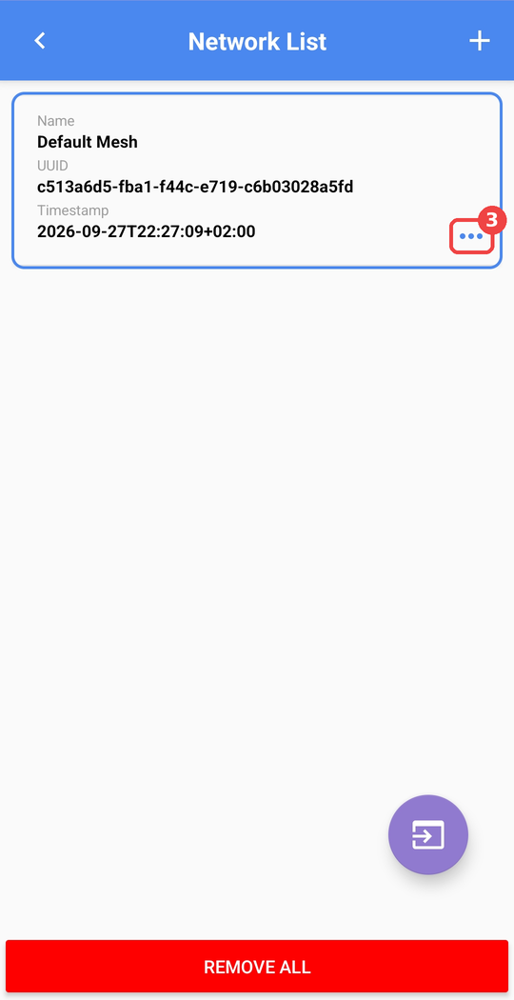
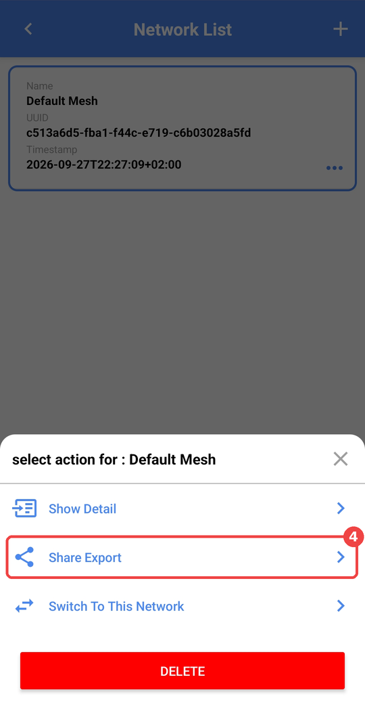
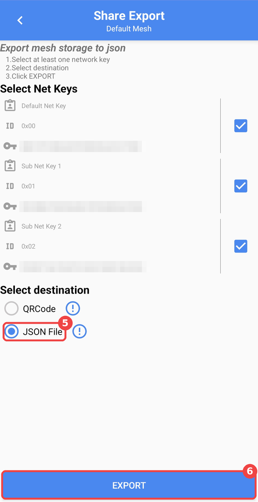
</p>

*(Auf dem letzten Bild sind die Schlüssel absichtlich verpixelt.)*

> 🔒 Diese Datei enthält die **Schlüssel deiner Lampen**. Gib sie nicht weiter und lade sie **nie** auf GitHub hoch.

> **Fehlt eine Lampe im Export?** Das ist normal und kein Problem. Manche Leuchten (z. B. OPPLE) haben alle
> **dieselbe Geräte-UUID**, und die Telink-App überschreibt dann beim Anlernen den vorherigen Eintrag. Aus der Datei
> braucht die Bridge eigentlich nur die **Schlüssel**: Die Lampen **sucht sie danach selbst** und findet dabei auch
> den richtigen IV-Index.

## Schritt 3 – Firmware installieren

### Variante A: Im Browser (empfohlen)

1. Board per USB anstecken. Vorher alle Programme schließen, die den Anschluss belegen könnten (Arduino IDE, VS Code/PlatformIO usw.).
2. Den **Web-Installer** in **Chrome oder Edge** am PC öffnen (nicht am Handy):
   **https://mariofritzer.github.io/OPPLE-Smart-Connect-Box-DIY/**
3. **„Firmware installieren“** klicken.
4. Im Fenster den **ESP auswählen** **(1)** → **Verbinden** **(2)**. Welcher Eintrag ist der ESP?
   - **„USB JTAG/serial debug unit“**: ESP32-C3, -C6 und -S3 direkt über USB
   - **„USB-SERIAL CH340“** oder **„CP210x“**: Boards mit USB-Wandlerchip, z. B. ESP32 DevKit
   - Im Zweifel ESP abstecken und schauen, welcher Eintrag verschwindet.
5. **Install SkyBridge** **(3)** → beim ersten Mal **Erase device** anhaken **(4)** → **Next** **(5)** → **Install** **(6)**.
6. Warten (ca. 2 Minuten, **Fenster im Vordergrund lassen**), bis **„Installation complete!“** erscheint → **Next** **(7)**.
7. Board kurz ab- und wieder anstecken.

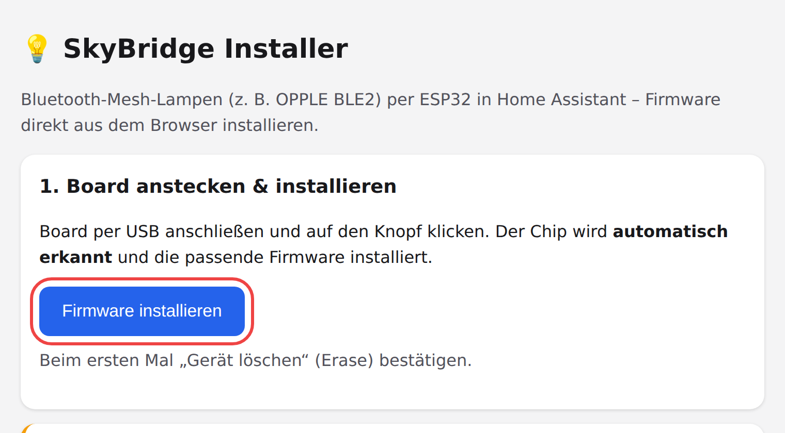

<p>
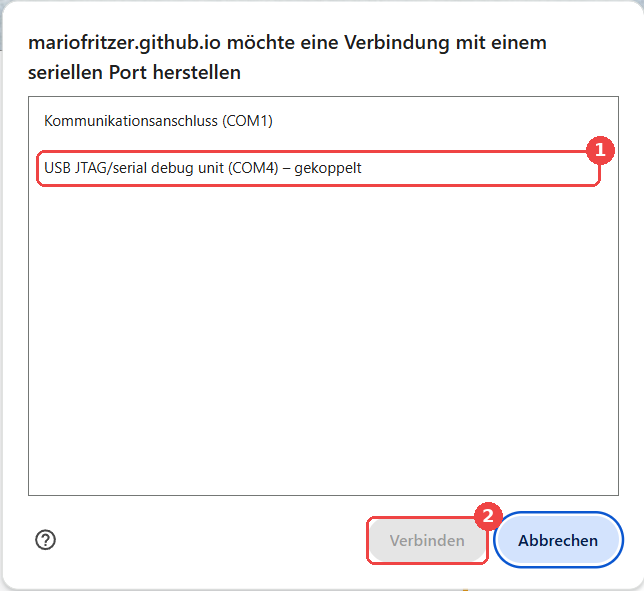
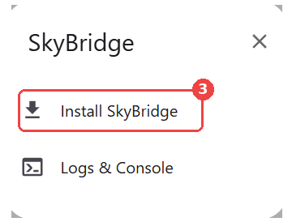
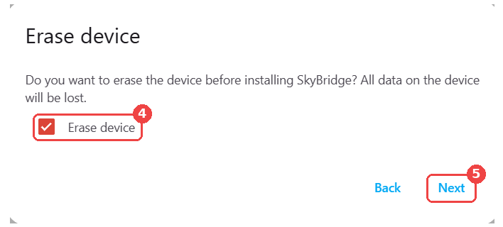
</p>
<p>
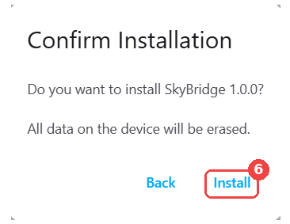
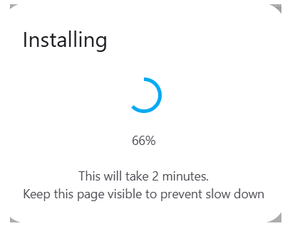
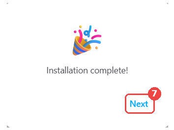
</p>

### Variante B: Mit Python-Skript

```bash
python -m pip install esptool
python tools/flash.py              # sucht den Anschluss selbst
python tools/flash.py --port COM4  # oder Anschluss angeben
```

Das Skript erkennt den Chip und flasht die passende Datei aus `docs/firmware/`.

### Variante C: Von Hand mit esptool

| Chip | Datei |
|---|---|
| ESP32 | `docs/firmware/skybridge-esp32.bin` |
| ESP32-S3 | `docs/firmware/skybridge-esp32s3.bin` |
| ESP32-C3 | `docs/firmware/skybridge-esp32c3.bin` |
| ESP32-C6 | `docs/firmware/skybridge-esp32c6.bin` |
| ESP32-C5 | `docs/firmware/skybridge-esp32c5.bin` |

```bash
python -m esptool --chip esp32c6 --port COM4 erase_flash
python -m esptool --chip esp32c6 --port COM4 write_flash 0x0 docs/firmware/skybridge-esp32c6.bin
```

Die Datei wird immer an Adresse **`0x0`** geschrieben.

## Schritt 4 – SkyBridge einrichten

Alles passiert **am Handy**, auf dem auch die Export-Datei liegt:

1. In den WLAN-Einstellungen mit **`SkyBridge-Setup`** verbinden **(1)**, Passwort **`skybridge`** **(2)** → **Verbinden** **(3)**.
   Falls das Handy „kein Internet“ meldet: trotzdem verbunden bleiben.

   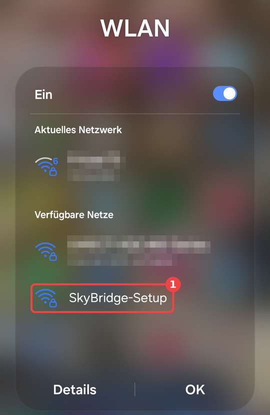 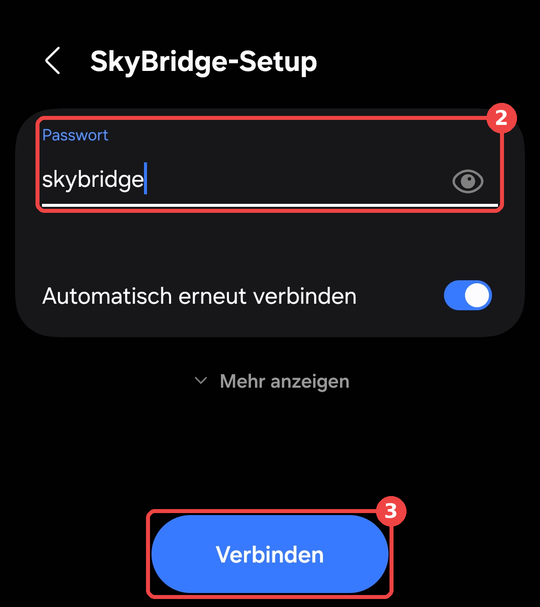

2. Im Browser **`http://192.168.4.1`** öffnen und **alles auf einer Seite** ausfüllen:
   - **Board** **(1)**, **WLAN-Name** **(2)** und **WLAN-Passwort** **(3)**. Das WLAN muss **2,4 GHz** sein.
   - **MQTT-Server** = IP-Adresse von Home Assistant **(4)**, **MQTT-Benutzer/-Passwort** **(5)(6)**, siehe Schritt 5
   - Bei **Export-Datei** die `mesh.json` aus Schritt 2 wählen **(7)**. NetKey und AppKey werden automatisch ausgefüllt.
     Die Lampenliste darf unvollständig oder leer sein.
   - **Alles speichern & neu starten** **(8)**

   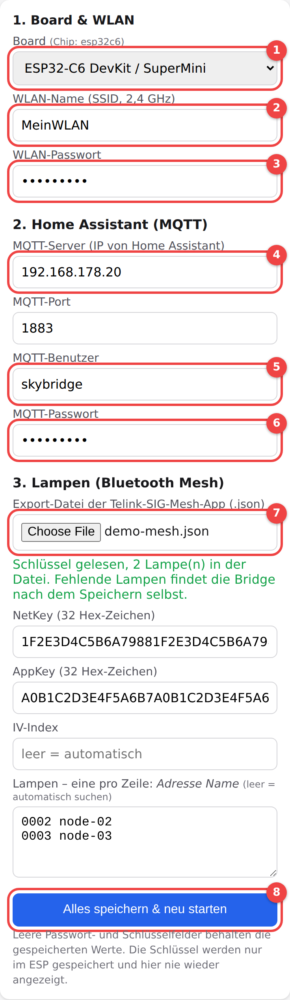

3. Die Bridge startet neu, verbindet sich mit deinem WLAN, **sucht alle Lampen** (10–60 Sekunden) und meldet sie
   in Home Assistant an. Das Einrichtungs-WLAN verschwindet.

4. **Statusseite:** Die IP-Adresse der Bridge im Router nachsehen (z. B. Fritzbox: *Heimnetz → Netzwerk*, Name meist
   „espressif“) und im Browser öffnen. Dort siehst du WLAN, MQTT, Mesh und jede Lampe. Mit **Lampen suchen** **(1)**
   startest du die Suche jederzeit neu, z. B. nach dem Anlernen einer weiteren Lampe. Gefundene Lampen heißen zuerst
   „Lampe 0005“ usw. Umbenennen kannst du sie im Feld „Lampen“ oder direkt in Home Assistant.

   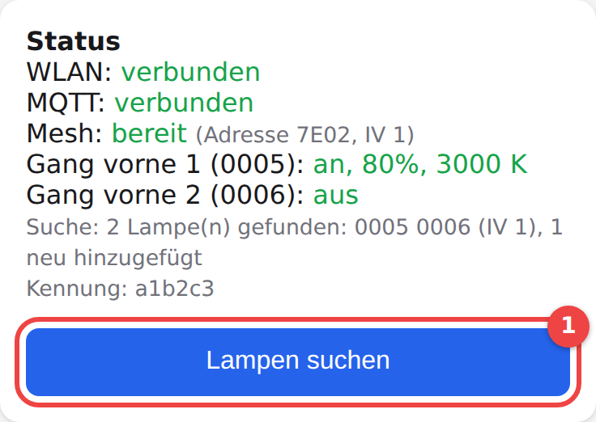

> Während der Ersteinrichtung ist Bluetooth absichtlich **aus**. Der ESP hat nur ein Funkteil, und das
> Einrichtungs-WLAN wäre sonst kaum erreichbar.

## Schritt 5 – Home Assistant

1. **MQTT** muss eingerichtet sein (*Einstellungen → Geräte & Dienste → MQTT*), z. B. mit dem Add-on *Mosquitto broker*.
2. **MQTT-Benutzer:** *Einstellungen → Personen → Benutzer → Benutzer hinzufügen*, z. B. `skybridge`
   (ohne Administratorrechte). Mosquitto akzeptiert HA-Benutzer automatisch.
   ⚠️ Der Name **`homeassistant`** ist beim Mosquitto-Add-on reserviert und funktioniert nicht.
3. Die Lampen erscheinen unter *MQTT → Geräte* als eigene Geräte, dazu **„Alle Lampen“** am Gerät *SkyBridge*.

   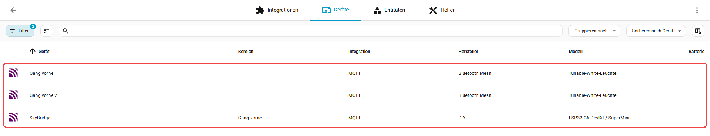

   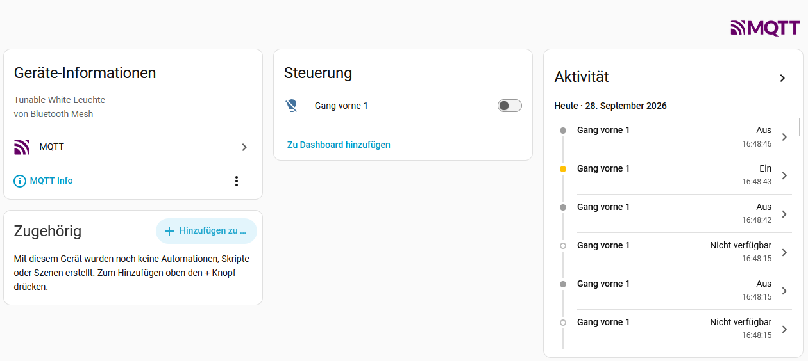
   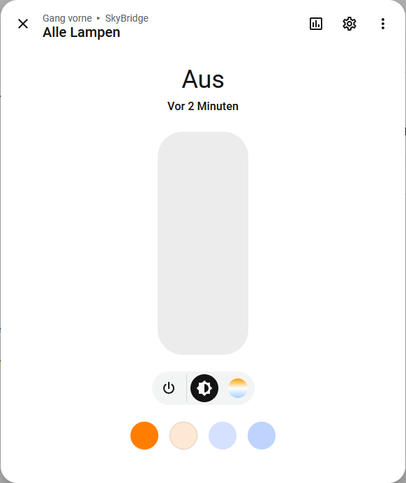

**Beispiel-Automation** (Präsenzmelder schaltet Licht):

```yaml
alias: Licht Gang per Bewegung
triggers:
  - trigger: state
    entity_id: binary_sensor.bewegung_gang
actions:
  - choose:
      - conditions:
          - condition: state
            entity_id: binary_sensor.bewegung_gang
            state: "on"
        sequence:
          - action: light.turn_on
            target:
              entity_id: [light.gang_vorne_1, light.gang_vorne_2]
            data:
              brightness_pct: 80
              color_temp_kelvin: 3000
    default:
      - delay: "00:01:00"
      - action: light.turn_off
        target:
          entity_id: [light.gang_vorne_1, light.gang_vorne_2]
mode: restart
```

> Einzelne Lampen bestätigen jeden Befehl und melden ihren echten Zustand. „Alle Lampen“ schickt einen
> gemeinsamen Befehl ohne Rückmeldung. Für Automationen sind die einzelnen Lampen deshalb die zuverlässigere Wahl.

> ⚠️ Hängen die Lampen an einem **Schaltaktor** (z. B. KNX), muss dieser **dauerhaft eingeschaltet** bleiben.
> Ohne Strom können die Lampen keine Funkbefehle empfangen.

---

## Fehlersuche

| Problem | Lösung |
|---|---|
| **„Failed to open serial port“** | Der Anschluss ist belegt. Arduino IDE, VS Code/PlatformIO, 3D-Drucker-Software und andere Tabs schließen, ggf. PC neu starten. |
| Board wird nicht erkannt | BOOT-Taste halten, RESET drücken, BOOT loslassen. Windows: Treiber für CH340/CP210x installieren. Anderes USB-Kabel probieren (manche können nur laden). |
| **„This chip is ESP32-C6, not ESP32-C3“** | Das Board ist anders beschriftet, als es ist. Die Datei für den **erkannten** Chip nehmen (Web-Installer und `flash.py` machen das automatisch). |
| Handy kommt nicht ins `SkyBridge-Setup`-WLAN | Netz „vergessen“ und neu verbinden. Passwort `skybridge`. „Kein Internet“ bestätigen. |
| Lampen erscheinen nicht in HA | Auf der Statusseite prüfen, ob MQTT „verbunden“ ist. MQTT-Server-IP und Benutzer prüfen (nicht `homeassistant`). |
| Lampe zeigt „noch keine Antwort“ | Auf der Statusseite **Lampen suchen** drücken. Die Suche findet auch Lampen mit geänderter Adresse und den richtigen IV-Index. Nicht mehr vorhandene Adressen aus der Lampenliste löschen. |
| Lampen „nicht erreichbar“ / Suche findet nichts | Haben die Lampen Strom? Bridge näher an die Lampen. Stimmen NetKey/AppKey (neue Export-Datei hochladen)? Lampen mit der Telink-App testen. |
| Alte Lampen hängen in Home Assistant | Gerät in HA öffnen → ⋮ → **Löschen**. |
| WLAN geändert | Reset-Taste **5 s halten**. WLAN/MQTT werden gelöscht, die Lampen-Einrichtung bleibt. Dann wieder mit `SkyBridge-Setup` verbinden. |

**Log ansehen:** Board per USB anschließen und einen seriellen Monitor mit **115200 Baud** öffnen,
z. B. im Web-Installer unter *„Logs & Console“* oder mit `python -m serial.tools.miniterm COM4 115200`.

## Sicherheit

- Im Quellcode stehen **keine Schlüssel und keine Passwörter**. Alles wird auf der Einrichtungsseite eingegeben und nur im ESP gespeichert.
- Die Mesh-Schlüssel werden nach dem Speichern **nie wieder angezeigt**.
- Die Einrichtungsseite hat **kein Passwort**. Jeder in deinem WLAN kann sie öffnen. Gäste gehören daher ins Gäste-WLAN.
- `.gitignore` schließt `*.json` aus, damit die Mesh-Export-Datei nicht versehentlich eingecheckt wird.

---

## Für Entwickler

### Selbst bauen

Benötigt **ESP-IDF v5.4.2**:

```bash
idf.py set-target esp32c6   # esp32 | esp32s3 | esp32c3 | esp32c6 | (esp32c5: idf.py --preview ...)
idf.py build
cd build && python -m esptool --chip esp32c6 merge_bin -o ../skybridge-esp32c6.bin @flash_args
```

Bei jedem Push baut GitHub Actions alle Varianten (`.github/workflows/build.yml`). Bei einem Tag `v*` werden
sie als Release veröffentlicht. Für den Web-Installer die neuen `.bin`-Dateien nach `docs/firmware/` kopieren
und GitHub Pages auf den Ordner `docs/` stellen (*Settings → Pages → Branch `main`, Ordner `/docs`*).

### Aufbau

| Datei | Inhalt |
|---|---|
| `main/mesh.c` | Bluetooth Mesh: Die Bridge läuft als zweiter Provisioner mit den importierten Schlüsseln und sendet Generic OnOff / Light Lightness / Light CTL |
| `main/mqtt_ha.c` | MQTT mit Home-Assistant-Discovery (JSON-Schema) |
| `main/portal.c` | Einstellungen (NVS) und Weboberfläche inkl. Import der Mesh-Export-Datei |
| `main/boards.h` | Board-Profile (Reset-Taste, XIAO-C6-Antenne) |
| `docs/` | Web-Installer (ESP Web Tools), fertige Firmware und Bilder (`docs/img/`) |
| `tools/flash.py` | Flash-Skript mit Chip-Erkennung |
| `apps/android/` | Telink SIG Mesh App (Apache 2.0) |

### MQTT-Themen

| Thema | Inhalt |
|---|---|
| `skybridge/<id>/status` | `online` / `offline` (Last Will) |
| `skybridge/<id>/<adresse>/set` | Befehl, JSON wie HA: `{"state":"ON","brightness":200,"color_temp":3000,"transition":2}` |
| `skybridge/<id>/<adresse>/state` | Zustand |
| `skybridge/<id>/<adresse>/avail` | Erreichbarkeit der Lampe |
| `skybridge/<id>/ffff/set` | alle Lampen |

## Lizenz

SkyBridge steht unter der [MIT-Lizenz](LICENSE). Die mitgelieferte Telink-App steht unter der
[Apache License 2.0](apps/android/LICENSE-Telink-Apache-2.0.txt).

Dieses Projekt ist nicht mit OPPLE Lighting oder Telink Semiconductor verbunden. Alle Marken gehören ihren Inhabern.
